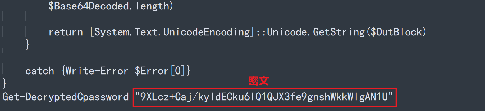

### Quick Start


#### Python脚本

```
root@lucasko:~/# python2 Gpprefencrypt.py  "I am lucas :)"
CZx9D2G2DplLYVMMOe2VEg==

root@lucasko:~/# python2 Gpprefdecrypt.py  CZx9D2G2DplLYVMMOe2VEg==
I am lucas :)
```


#### PowerShell脚本



```
PowerShell.exe -Exec Bypass -File Gpprefdecrypt.ps1
```

